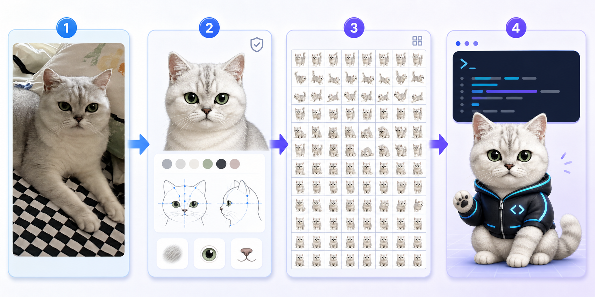
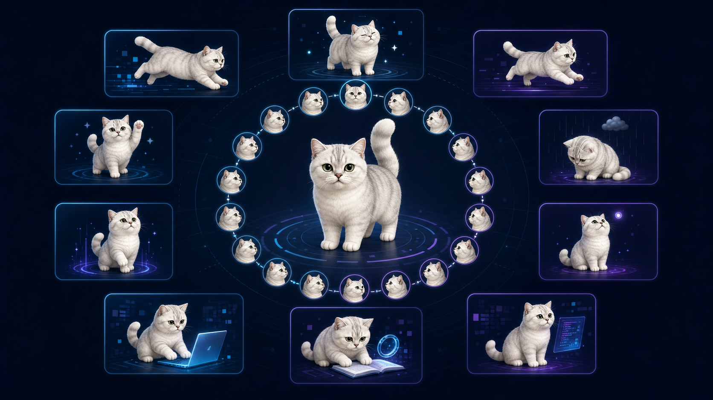

# Codex赛博萌宠养成计划


把你家猫猫、狗狗或其他宠物的照片，制作成会待机、奔跑、挥爪、跳跃、等待、工作、审查，并能跟随光标环视的 Codex Desktop v2 动画宠物。

这不是一份只教你“生成一张萌宠图”的提示词，而是一套可复用 Skill：从照片筛选、角色特征锁定、动作生成、8×11 图集组装，到透明度检查、安全边距修复、本地安装和缓存排错，形成完整闭环。

## 从照片到桌面 AI 搭子



照片只是起点。Skill 会先锁定宠物的眼睛、脸型、毛色、纹路和尾巴等身份特征，再生成动作族、组装 v2 图集，最后完成安装和实际显示验收。

## 能做什么

- 用 1–3 张真实宠物照片保持脸型、毛色、眼睛和花纹特征
- 生成 Codex 的 9 个标准动画状态
- 生成 16 个顺时针光标环视方向
- 检查 v2 图集尺寸、帧数、透明度和未使用单元格
- 自动修复“脚部被裁掉、尾巴显示不全”等安全边距问题
- 安装到 macOS/Linux 的 `~/.codex/pets/` 并更新当前选择
- 排查“仍显示默认机器人、切换后没变化、背景有彩边”等常见问题

## Codex v2 图集规格

| 项目 | 要求 |
|---|---|
| 图集尺寸 | 1536×2288 px |
| 网格 | 8 列 × 11 行 |
| 单元格 | 192×208 px |
| 标准状态 | 9 行 |
| 环视方向 | 16 个，分布在最后 2 行 |
| 清单版本 | `spriteVersionNumber: 2` |
| 推荐格式 | RGBA 无损 WebP |

标准动作依次为：待机、向右移动、向左移动、挥爪、跳跃、失败、等待输入、处理中、审查。idle 行包含 6 帧循环和 1 个 neutral 默认帧；最后两行按顺时针保存 000° 到 337.5° 的 16 个方向。



## 安装 Skill

在 Codex 中使用 Skill 安装器，从本仓库安装：

```text
请使用 skill-installer 安装：
https://github.com/chenbaiji518-oss/codex-cyber-pet/tree/main/skills/codex-cyber-pet
```

也可以手动复制：

```bash
git clone https://github.com/chenbaiji518-oss/codex-cyber-pet.git
cp -R codex-cyber-pet/skills/codex-cyber-pet ~/.codex/skills/
```

重新打开 Codex 后即可使用 `$codex-cyber-pet`。

## 最简单的使用方式

上传宠物照片，然后说：

```text
使用 $codex-cyber-pet，把这些照片制作成 Codex 赛博萌宠。
宠物叫鸡腿，称呼我为爸爸。保留绿色眼睛、银渐层毛色和额头纹路。
```

Skill 会依次完成：

1. 分析照片并建立不可变身份特征；
2. 生成主形象和 9 个动作族；
3. 生成上、右、下、左四个主方向；
4. 插值生成完整 16 个环视方向；
5. 组装并验证 8×11 图集；
6. 修正透明边缘和显示安全边距；
7. 安装并提示完全退出 Codex 后重启。

## 手动验证

依赖 Python 3.10+ 与 Pillow：

```bash
python -m pip install Pillow
python skills/codex-cyber-pet/scripts/validate_atlas.py \
  ./my-pet/spritesheet.webp \
  --manifest ./my-pet/pet.json
```

通过时会输出：

```json
{
  "ok": true,
  "width": 1536,
  "height": 2288,
  "columns": 8,
  "rows": 11,
  "spriteVersionNumber": 2
}
```

## 修复显示不全

如果脚、尾巴或跳跃动作被窗口裁切：

```bash
python skills/codex-cyber-pet/scripts/normalize_safe_margins.py \
  ./my-pet/spritesheet.webp \
  ./my-pet/spritesheet-safe.webp
```

该脚本会逐格保持比例缩放，将有效内容放入安全显示区，并为底部保留约 24 px。随后再次验证，并把 `pet.json` 的 `spritesheetPath` 指向修复文件。

## 本地安装

宠物目录应包含：

```text
my-pet/
├── pet.json
└── spritesheet.webp
```

执行：

```bash
python skills/codex-cyber-pet/scripts/install_pet.py \
  --pet-dir ./my-pet \
  --select
```

脚本会在覆盖同 ID 宠物前创建带时间戳的备份，并在 `~/.codex/config.toml` 中选择 `custom:<pet-id>`。

安装后必须真正退出 Codex：macOS 使用 `Command + Q`。只关掉窗口，旧宠物进程和贴图缓存仍可能存在。

## 常见问题

### 为什么还是蓝色机器人？

检查宠物目录、`pet.json`、`spritesheetPath` 和配置选择值。文件如果在 Codex 启动后才写入，需要完全退出再开。

### 为什么图片看着正常，宠物窗口却缺脚？

Codex 的显示区域比 192×208 单元格更保守。主体底边只留 6 px 时，实际窗口可能裁切。运行安全边距脚本，把底部留白增加到约 24 px。

### 为什么动作还是很少？

通常是把 v1 的 8×9 图集当成 v2。v2 必须为 1536×2288，并且最后两行包含 16 个固定顺序环视方向。

### 为什么左右方向反了？

方向以观看者/屏幕坐标定义，不是宠物自身左右。090° 是屏幕右，270° 是屏幕左。

## 仓库结构

```text
skills/codex-cyber-pet/
├── SKILL.md
├── agents/openai.yaml
├── references/
│   ├── atlas-contract.md
│   ├── workflow.md
│   └── troubleshooting.md
└── scripts/
    ├── install_pet.py
    ├── normalize_safe_margins.py
    └── validate_atlas.py
```

## 隐私说明

宠物照片属于个人素材。使用图像生成服务前应确认其隐私与保留策略；不要把包含家庭住址、人物面孔、定位信息或其他敏感内容的原图直接发布到仓库。此仓库不包含用户原始照片或生成的私人宠物资产。

## License

MIT License。你可以自由使用、修改和分享本 Skill。

## 如果这个项目帮到了你

如果这个项目对你有帮助，也愿意给我一点鼓励，可以自愿打赏。打赏不是使用 Skill 的前提，也不会影响任何功能；谢谢你的支持！


